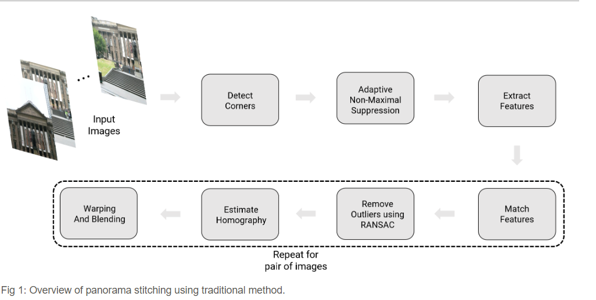
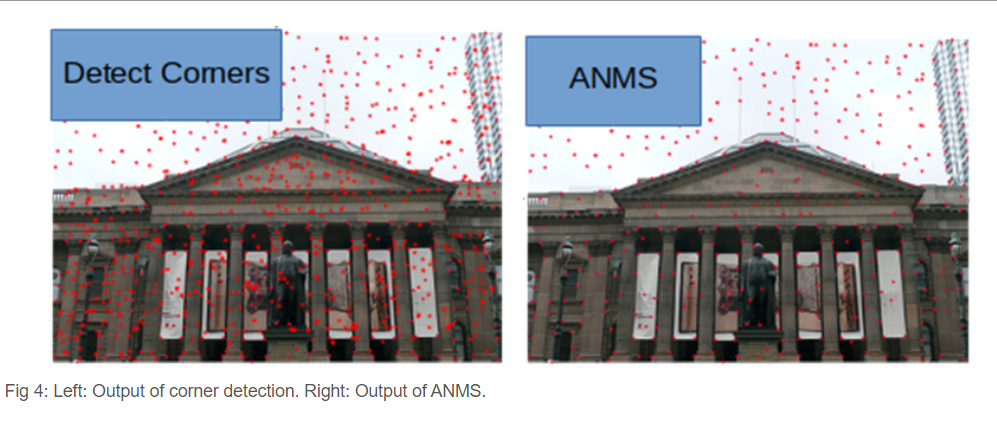
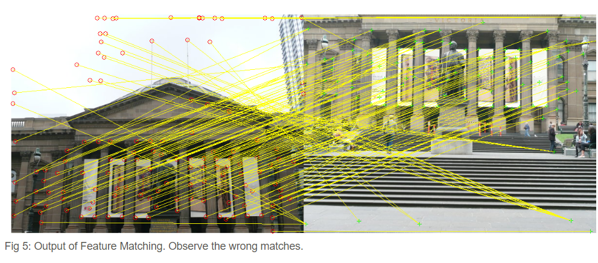
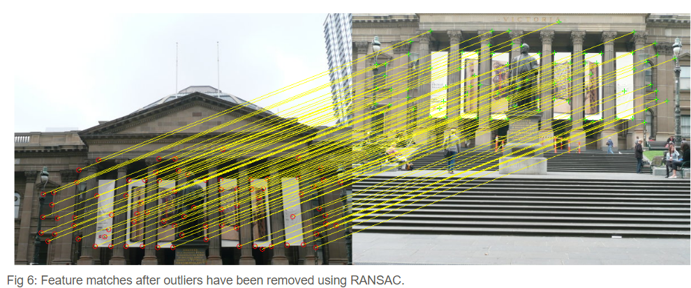
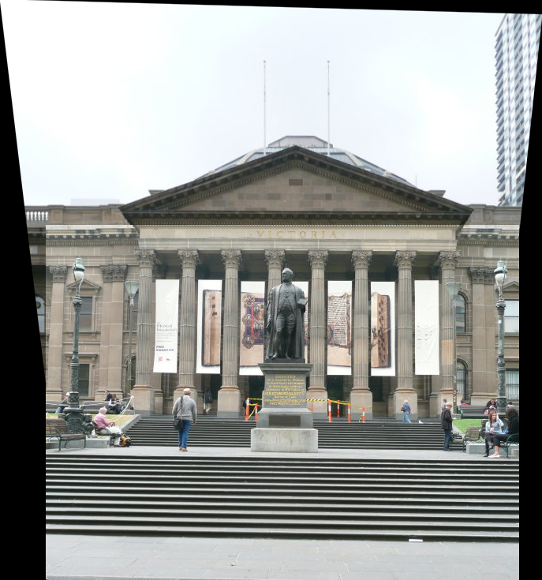
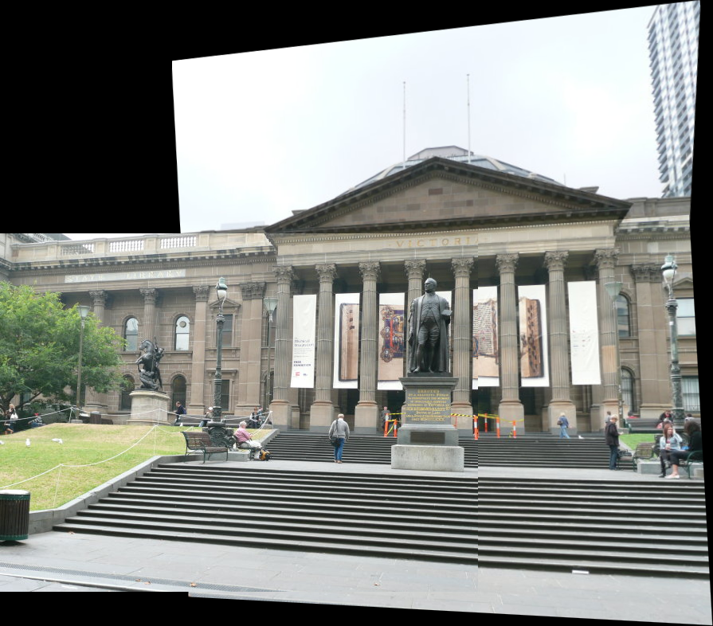
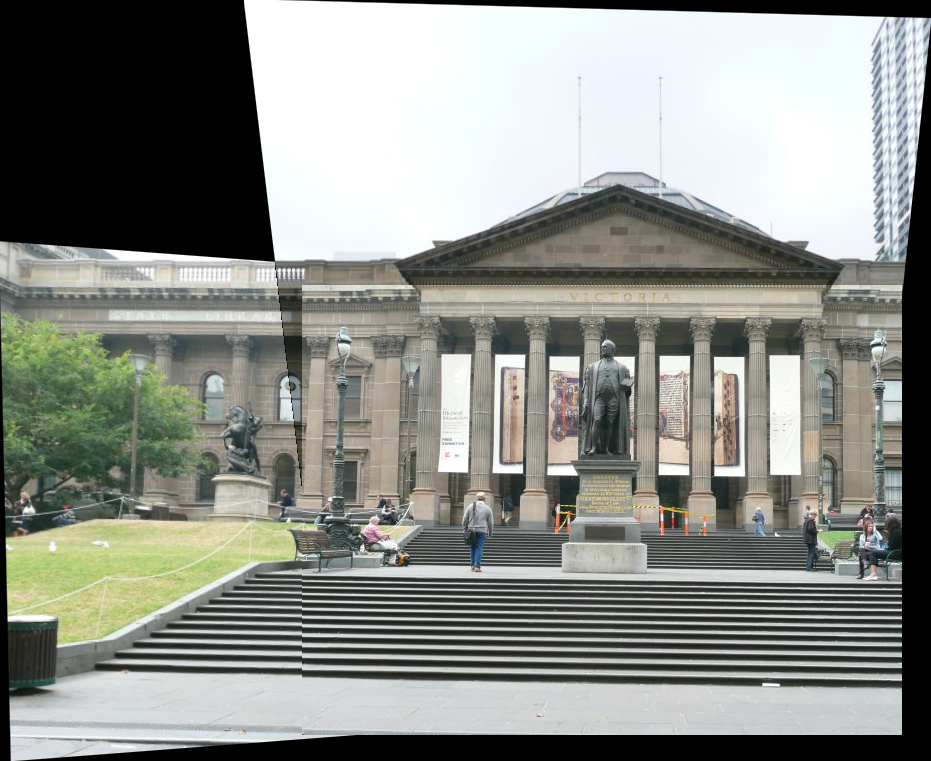

# Panorama_Stitching
## Auto Panorama Stitching

### Running the code
```
python stitch.py
python stitch.py -filepath <> -saveFolder <> -imagesFolder <>
```

<p align="center">

</p>

<p align="center">

</p>

<p align="center">

</p>

<p align="center">

</p>

<p align="center">

</p>

<p align="center">

</p>

<p align="center">

</p>
